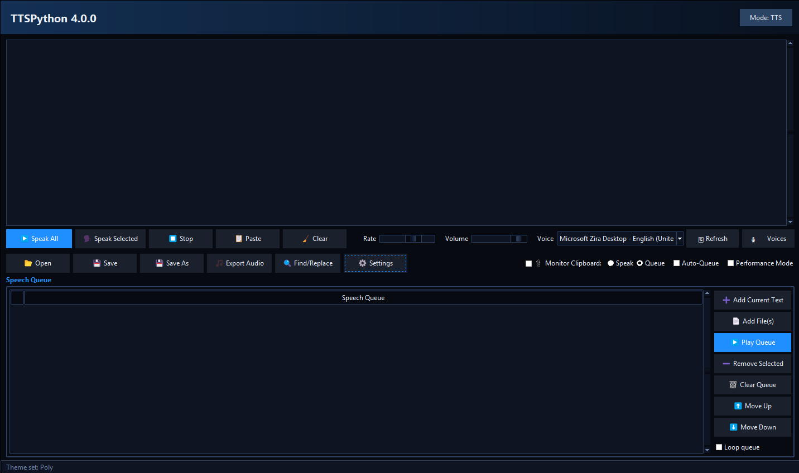

# TTSPython

A Windows text-to-speech (TTS) and speech-to-text (STT) desktop application built with Python and tkinter, using the Windows SAPI5 speech engine.




## Description

TTSPython is a Windows-first desktop tool that turns text into spoken audio via the system SAPI5 voices and transcribes speech to text entirely offline. It is built around `pyttsx3` for TTS, with Windows COM (`pythoncom`/pywin32) used for stable threaded speech, and Windows-specific integrations such as opening the `ms-settings:speech` and `ms-settings:sound` panels. It is a Windows application and is not cross-platform; it does not support macOS or Linux.

## Features

### Text-to-Speech
- **Speak All** / **Speak Selected** / **Stop** controls for reading text or a selection.
- Adjustable **Rate** and **Volume** sliders.
- **Voice selector** populated from the installed SAPI5 voices.
- **Refresh** button to detect newly installed voices without restarting.
- **Voices** button that opens the Windows Speech settings panel (`ms-settings:speech`) to install more voices.

### Speech-to-Text
- Offline transcription via `faster-whisper` (CPU, `int8` quantization).
- **Start / Stop recording** controls; the transcript is inserted into the editor.
- Optional model unload and auto-unload (with a configurable delay in minutes) to free RAM when STT is idle.
- A **mode toggle** switches the app between TTS and STT.

### Speech Queue
- Add the current editor text, add file(s), play the queue, remove the selected item, or clear the queue.
- Displayed as a tree with a color icon per item (💬 text / 📄 file / 📋 clipboard) and a "Speech Queue" heading.
- **Move Up** / **Move Down** reorder items; **Loop queue** repeats playback; the **Delete** key removes the selected item.
- The item currently playing is highlighted using the active theme's accent color.

### Clipboard Monitor
- Watches the clipboard and either **Speaks** or **Queues** copied text.
- **Auto-Queue** option so copied items are queued while speech is already playing.

### Export Audio
- Export text to **WAV** or **MP3** using the current voice, rate, and volume settings.
- Export runs in a background thread, so the UI stays responsive; the Export button is disabled until it finishes.

### Find & Replace
- Dialog with **case-sensitive** and **regex** options, plus **Find Next** / **Replace** / **Replace All**.

### Themes
- 11 themes: Dark, Twilight, Light, High Contrast, Forest, New Vegas, Spiral, Poly, Sunset, Paper, Graphite.
- Choose a theme in **Settings → Theme** tab.
- All toolbar, file, queue, and STT buttons show **color emoji icons** (rendered via Pillow/Segoe UI Emoji; falls back to text-only if unavailable).

### Settings
- Dialog with three tabs:
  - **Hotkeys**: 10 customizable shortcuts with visual key capture.
  - **Theme**: theme preset and **Performance Mode**.
  - **Audio**: STT input microphone, TTS output device note, STT model unload options and auto-unload delay (minutes).
- **Performance Mode** lowers UI update frequency and clipboard polling for lower-end machines.
- **Reset to Defaults** (Hotkeys tab) resets hotkeys **and** theme preset, Performance Mode, and STT/audio device + unload settings to their defaults.
- Settings persist to `tts_settings.json` in the script directory (the window size/position is also saved).

### v4.0.0 UI Overhaul
- New **gradient header bar** with the title (`TTSPython 4.0.0`), version, and mode toggle.
- Cohesive modern palettes for all 11 themes.
- Refined `ttk` styling: padded buttons, themed sliders/comboboxes/check/radio/notebook/scrollbars, and hover/active/focus states.
- **Color emoji icons** on all buttons (rendered to bitmaps via Pillow so they are not gray outline glyphs on Windows).
- Themed Search (Find & Replace) and Settings dialogs.

## Requirements
- Windows (SAPI5 is required for TTS).
- Python 3.8–3.13.
- `Pillow` — renders the color emoji icons (text-only fallback if missing).
- For TTS: `pyttsx3` and `pywin32` (Windows COM support).
- For STT: `faster-whisper` and `sounddevice` (offline transcription, microphone input).

## Installation

### Prerequisites
- **Windows 10 or 11** — SAPI5 (the speech engine) is built into Windows.
- **Python 3.8–3.13** — get it from [python.org](https://www.python.org/downloads/windows/).
  During setup, tick **"Add Python to PATH"** so you can run `python` from any folder.

### Steps
1. **Get the code** — clone the repository, or download the ZIP and extract it. Then open a terminal in the `TTSPython` folder:
   ```powershell
   git clone https://github.com/yourusername/TTSPython.git
   cd TTSPython
   ```
2. **Install dependencies** — this runs `dependencies.bat`, which installs only the missing packages (it never upgrades Python or pip):
   ```powershell
   ./dependencies.bat
   ```
3. **Run the app**:
   ```powershell
   python TTSPython.py
   ```
   The window opens centered on your screen. Your settings (theme, hotkeys, window size) are saved automatically for next time.

> **First run tip:** If you see a Windows Defender / SmartScreen warning, choose **"More info" → "Run anyway"** — the script is a plain Python file, not a signed installer.

## Usage

### Running
```powershell
python TTSPython.py
```

### Basic TTS
1. Type or paste text into the editor.
2. Click **Speak All** or press `Ctrl+Enter` to speak everything.
3. Select text, then click **Speak Selected** or press `Ctrl+Shift+Enter`.
4. Click **Stop** or press `Esc` to interrupt.
5. Adjust the voice, rate, and volume as needed.

### Speech Queue
- **Add Current Text**: queue the editor content.
- **Add File(s)**: queue one or more text files.
- **Play Queue**: play queued items sequentially; the active item is highlighted in the theme accent color.
- **Remove Selected** / **Clear Queue**: manage the queue.
- **Move Up** / **Move Down**: reorder items. **Loop queue** repeats playback. Press **Delete** to remove the selected item.

### Clipboard Monitor
- Enable **Monitor Clipboard** and choose **Speak** or **Queue**.
- With **Auto-Queue** on, copied items are added to the queue while speech is already playing.

### Export Audio
- Click **Export Audio** or press `Ctrl+E`, choose WAV or MP3, and save.

### Speech-to-Text
1. Switch the mode toggle to STT.
2. Click **Start Recording** and speak into the configured microphone.
3. Click **Stop Recording** to transcribe; the text is inserted into the editor.
4. Use **Settings → Audio** to pick the STT input device and configure model unload behavior.

### Adding Voices
- Click **Voices** in the app to open Windows Speech settings, or open `ms-settings:speech` directly.
- Install additional voices, then click **Refresh** to detect them.
- See [`ADD_VOICES_GUIDE.md`](ADD_VOICES_GUIDE.md) for details.
- Run `python check_voices.py` to list installed SAPI5 voices.

## Default Hotkeys

All hotkeys are customizable in **Settings → Hotkeys**.

| Action | Default Shortcut |
|--------|------------------|
| Speak All | `Ctrl+Enter` |
| Speak Selected | `Ctrl+Shift+Enter` |
| Stop Speaking | `Esc` |
| Open File | `Ctrl+O` |
| Save File | `Ctrl+S` |
| Save As | `Ctrl+Shift+S` |
| Paste | `Ctrl+V` |
| Clear | `Ctrl+L` |
| Find/Replace | `Ctrl+F` |
| Export Audio | `Ctrl+E` |

## Themes

Select a theme in **Settings → Theme**:

Dark · Twilight · Light · High Contrast · Forest · New Vegas · Spiral · Poly · Sunset · Paper · Graphite

## Settings Overview

Settings are stored in `tts_settings.json` in the script directory and loaded automatically on startup. The Settings dialog has three tabs:

- **Hotkeys**: capture and rebind any of the 10 shortcuts.
- **Theme**: choose a theme preset and toggle Performance Mode.
- **Audio**: STT input microphone, TTS output device note, and STT model unload / auto-unload delay (minutes).

## Troubleshooting

### No Voices Available
- TTS relies on Windows SAPI5. Ensure the Speech API is present (it ships with Windows).
- Click **Refresh** to reload the voice list.
- Click **Voices** (or open `ms-settings:speech`) to install more voices.
- Run `python check_voices.py` to list what is installed.

### pywin32 / COM Issues on Windows
- Some threaded speech operations require `pywin32`. Install it with:
  ```powershell
  pip install pywin32
  python -m pywin32_postinstall -install
  ```

### Settings Not Saving
- `tts_settings.json` is written to the script directory. Check write permissions there, or run the app from a writable location.

### Speech Doesn't Stop Immediately
- The engine typically finishes the current sentence before stopping; allow a moment after pressing **Stop** / `Esc`.

### Clipboard Monitoring Not Working
- Ensure **Monitor Clipboard** is enabled and the desired mode (Speak / Queue) is selected.

### Export Audio Fails
- Check write permissions and disk space in the target directory; try WAV if MP3 fails.

## License

Released under the MIT License — see the [`LICENSE`](LICENSE) file at the repository root.

## Changelog

See [`CHANGELOG.md`](CHANGELOG.md) for the full version history.

## Additional Guides

- [`FEATURE_GUIDE.md`](FEATURE_GUIDE.md) — in-depth feature walkthrough.
- [`QUICK_REFERENCE.md`](QUICK_REFERENCE.md) — quick command and shortcut reference.
- [`ADD_VOICES_GUIDE.md`](ADD_VOICES_GUIDE.md) — installing and managing SAPI5 voices.
